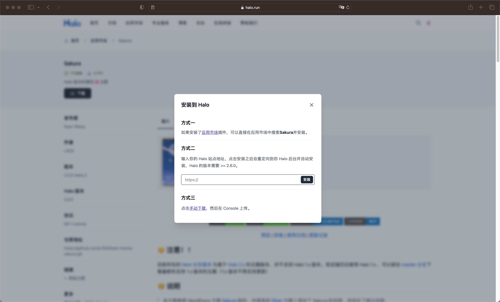

<h1 align="center">Sakura</h1>

  
  
  
  

  <a href="https://lixingyong.com">预览</a> | <a href="#安装主题">安装</a> | <a href="https://lixingyong.com/archives/halo%E4%B8%BB%E9%A2%98sakura%E9%A3%9F%E7%94%A8%E8%AF%B4%E6%98%8E">使用文档</a> | <a href="https://github.com/LIlGG/halo-theme-sakura/commits/next">更新记录</a>

## 🧐 说明

> 本主题参照 WordPress 主题 [Sakura](https://github.com/mashirozx/Sakura) 制作，在原有的 [Siren](https://github.com/halo-dev/halo-theme-siren) 主题上添加了 Sakura 的内容，并优化了部分内容。

如果各位有什么好的想法，希望可以提交 `ISSUE`，如果有兴趣参与内容贡献，可以提交 `PR`；

## 🔥 预览

DEMO：[https://lixingyong.com/](https://lixingyong.com/)

截图：

## ⭐️ 快速入门

### 安装 Halo（已安装可跳过）

前往 [Halo 安装指南](https://docs.halo.run/category/%E5%AE%89%E8%A3%85%E6%8C%87%E5%8D%97) ，按照文档步骤进行安装。

### 安装主题

#### 自动安装（Halo 的版本需要 >= 2.6.0）

主题已上架 [Halo 官方应用市场 - Sakura](https://halo.run/store/apps/app-YGkgz)

**可以直接使用应用市场进行安装，也可以通过下述步骤进行安装。**

1. 点击上方链接直达或者进入 Halo 官方应用市场，找到本主题。
2. 点击左下角 `下载` 按钮。
3. 弹出的对话框中，输入自己的网站地址，点击安装。
  

#### 手动安装
1. 点击[下载](https://github.com/LIlGG/halo-theme-sakura/archive/next.zip)
2. 进入 Halo 后台 -> 主题
3. 点击右上角 “主题”， 在弹出的窗口中选择 “安装主题”
4. 选择下载好的主题包（zip）
5. 安装完成后的主题将会出现在 “未安装” 内，点击启用主题

### 插件依赖
> 所有插件均为可选，不安装则不会出现对应功能。部分插件可能已经预设在 Halo 内。

- 评论功能，需插件 [plugin-comment-widget](https://github.com/halo-sigs/plugin-comment-widget/releases)
- 搜索功能，需插件 [plugin-search-widget](https://github.com/halo-sigs/plugin-search-widget/releases)
- 友链页面，需插件 [plugin-links](https://github.com/halo-sigs/plugin-links) 支持
- 图库页面，需插件 [plugin-photos](https://github.com/halo-sigs/plugin-photos) 支持
- 瞬间页面，需插件 [plugin-moments](https://github.com/halo-sigs/plugin-moments) 支持

> 推荐插件

- Live2D 看板娘，插件地址：[plugin-live2d](https://github.com/LIlGG/plugin-live2d)

## ⚡ 功能

点击查看完整功能列表

- [x] 注重性能。主题内资源采用异步加载，延迟加载。
- [x] 完美支持 Pjax。
- [x] SEO 优化。
- [x] 主题国际化。
- [x] 全局使用 svg 图标库。
- [x] 自定义扩展，主题触发各核心功能均会产生 window 事件，方便用户扩展功能。
- [x] 支持深色模式。
- [x] 移动端深入适配。
- [x] 导航栏菜单支持动画、图标，且支持二级菜单。
- [x] 完美兼容 Halo 2.x 评论、搜索、瞬间、图库、友链等插件。
- [x] 首页支持故障文本和头像，支持标准与图文双风格切换。
- [x] 支持首页视频，视频支持 HLS 等流媒体。
- [x] 集成音乐播放器插件，支持 [Meting API](https://github.com/injahow/meting-api)。
- [x] 图片懒加载，自适应大小。
- [x] 主题已集成代码高亮，多种高亮支持，实现仿 Mac 风格。
- [x] 主题背景切换
- [x] 自定义友链页面
- [x] 文章目录支持
- [x] 个人信息
- [x] 分享功能
- [x] 分类、标签支持雷达图及云标签
- [x] 全局提示&复制提醒功能
- [x] 瀑布流相册
- [x] 适配瞬间页面，支持点赞及评论。
- [x] 文章字数、更新时间提醒
- [x] 404 页面
- [x] 用户登录及文章所属用户

> Tip:
>> 上述功能大部分均可配置。具体操作在 后台 -> 外观 -> 主题 -> 设置 中进行配置

##   待适配功能

- [ ] 自定义邮件模板，需等待 Halo 支持
- [ ] 自定义符合主题的评论插件

## 💫 与 1.x 比较

在主题 2.0.0 版本之后，完全重构了主题，因此在功能与性能上，将于 1.x 有很大的区别。

2.x 在很多功能上做了优化，并且较于 1.x 在性能上有了巨大提升，后续将会持续支持 2.x 相关功能，因此目前推荐进行升级，下述表格仅供参考。

|  功能 | 2.x | 1.x | 备注 |
| :---: | :---: | :---: | :---: |
| 全站 Pjax | √ | √ |  |
| 主题资源异步加载 | √ | × |  |
| 主题资源延迟加载 | √ | × |  |
| SEO 优化 | √ | × |  |
| 移动端适配 | √ | √ |  |
| 深色模式 | √ | √ |  |
| 主题自定义评论 | × | √ |  |
| 路由搜索 | √ | √ | 2.x 支持插件搜索及路由搜索 |
| 邮件模板 | × | √ |  |
| 看板娘 | √ | √ | 2.x 使用插件支持，并且可以基于 ChatGPT 进行对话 |
| 首页视频 | √ | √ | 2.x 不再支持失效的接口，但默认的本地视频支持 HLS 等流视频 |
| 背景音乐 | √ | √ | 2.x 使用 Meting 接口，因此能够支持多种渠道的音乐 |
| 文章内音乐 | × | √ | 不再支持文章内使用音乐，后续可能使用插件实现 |
| 说说 | √ | √ | 2.x 改名为瞬间 |
| 图库 | √ | √ |  |
| 友链 | √ | √ |  |

## ☃️ 贡献者

感谢这些很优秀的人：

<!-- ALL-CONTRIBUTORS-LIST:START - Do not remove or modify this section -->
<!-- prettier-ignore-start -->
<!-- markdownlint-disable -->
<table>
  <tbody>
    <tr>
      <td align="center" valign="top" width="14.28%"><a href="https://lixingyong.com"> <b>Takagi</b></a> <a href="https://github.com/LIlGG/halo-theme-sakura/commits?author=LIlGG" title="Code">💻</a> <a href="https://github.com/LIlGG/halo-theme-sakura/commits?author=LIlGG" title="Documentation">📖</a> <a href="#example-LIlGG" title="Examples">💡</a></td>
      <td align="center" valign="top" width="14.28%"><a href="https://ryanc.cc"> <b>Ryan Wang</b></a> <a href="#design-ruibaby" title="Design">🎨</a> <a href="#ideas-ruibaby" title="Ideas, Planning, & Feedback">🤔</a></td>
      <td align="center" valign="top" width="14.28%"><a href="https://mashiro.best"> <b>Parasomnia</b></a> <a href="https://github.com/LIlGG/halo-theme-sakura/commits?author=parasomn1a" title="Code">💻</a> <a href="#design-parasomn1a" title="Design">🎨</a></td>
      <td align="center" valign="top" width="14.28%"><a href="https://2heng.xin"> <b>Mashiro</b></a> <a href="#design-mashirozx" title="Design">🎨</a> <a href="#ideas-mashirozx" title="Ideas, Planning, & Feedback">🤔</a></td>
      <td align="center" valign="top" width="14.28%"><a href="https://github.com/ShiinaKin"> <b>mashirot</b></a> <a href="https://github.com/LIlGG/halo-theme-sakura/commits?author=ShiinaKin" title="Code">💻</a></td>
    </tr>
  </tbody>
</table>

<!-- markdownlint-restore -->
<!-- prettier-ignore-end -->

<!-- ALL-CONTRIBUTORS-LIST:END -->

该项目遵循 [所有参与者](https://github.com/kentcdodds/all-contributors) 规范。 

## 赞助
> 由于主题开发需要一定的周期，再加上主题内部 API 所需的服务器和 CDN 都是一笔不小的开支，如果您喜欢我的主题，可以考虑资助一下~ 您的支持将是我继续开发主题的动力。

|  <b>微信</b>  |  <b>支付宝</b>   | 
| :---: | :---: |

欢迎其他各种形式的捐助！

## 作者

**halo-theme-sakura** © [LIlGG](https://github.com/LIlGG)，基于 [MIT](./LICENSE) 许可证发行。 
作者及其贡献者共有版权 （[帮助维护列表](https://github.com/LIlGG/halo-theme-sakura/graphs/contributors)）。

> [lixingyong.com](https://lixingyong.com) · GitHub [@LIlGG](https://github.com/LIlGG)

## 希望你喜欢！

