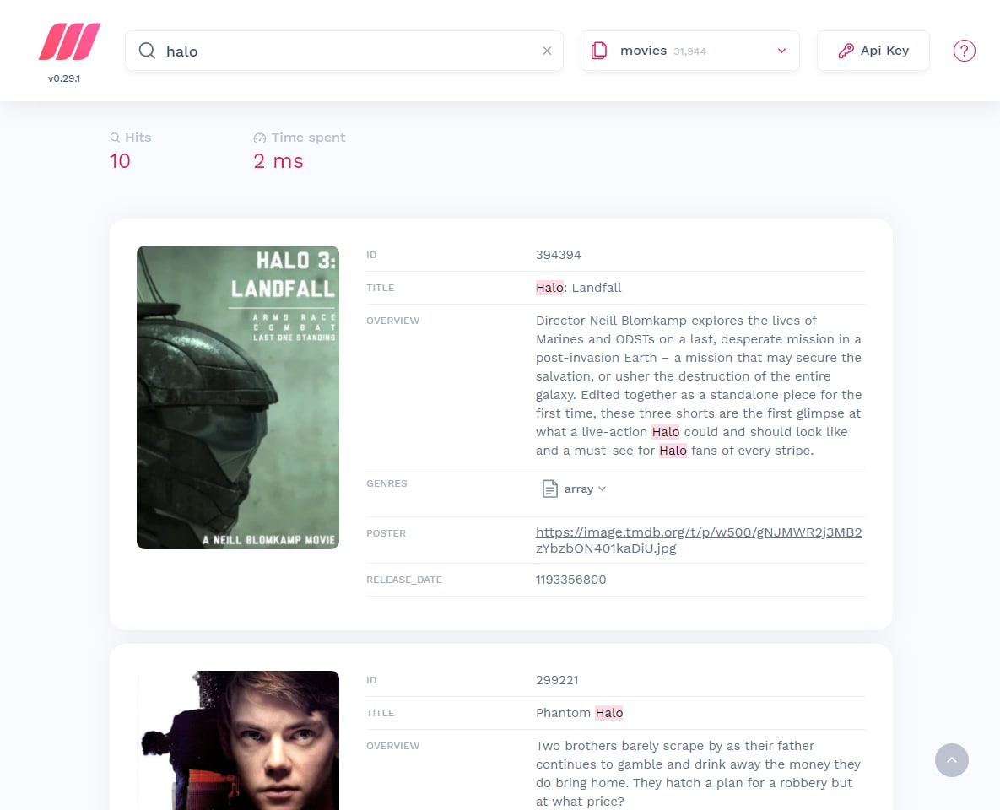
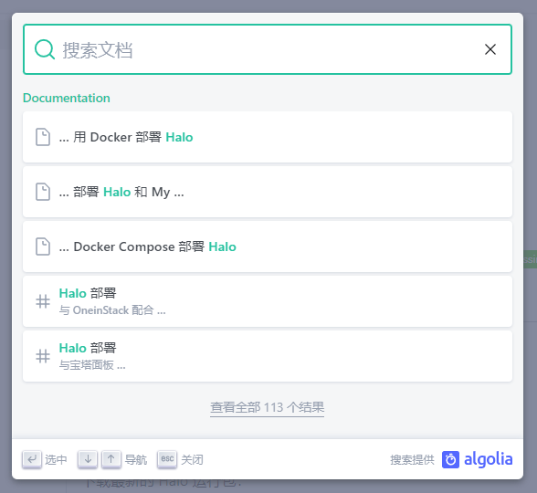

# 在 Halo 中实践全文搜索

主题端需全文搜索接口用于模糊搜索文章，且对效率要求极高。已经有对应的 Issue
提出，可参考：<https://github.com/halo-dev/halo/issues/2637>。

实现全文搜索的本地方案最好的就是 Apache 旗下开源的 [Lucene](https://lucene.apache.org/)
，不过 [Hibernate Search](https://hibernate.org/search/) 也基于 Lucene 实现了全文搜索。Halo 2.0 的自定义模型并不是直接在
Hibernate 上构建的，也就是说 Hibernate 在 Halo 2.0 只是一个可选项，故我们最终可能并不会采用 Hibernate Search，即使它有很多优势。

Halo 也可以学习 Hibernate 适配多种搜索引擎，如 Lucene、ElasticSearch、MeiliSearch 等。默认实现为 Lucene，对于用户来说，这种实现方式部署成本最低。

## 搜索接口设计

### 搜索参数

字段如下所示：

- keyword: string. 关键字
- sort: string[]. 搜索字段和排序方式
- offset: number. 本次查询结果偏移数
- limit: number. 本次查询的结果最大条数

例如：

```bash
http://localhost:8090/apis/api.halo.run/v1alpha1/posts?keyword=halo&sort=title.asc&sort=publishTimestamp,desc&offset=20&limit=10
```

### 搜索结果

```yaml
hits:
  - name: halo01
    title: Halo 01
    permalink: /posts/halo01
    categories:
      - a
      - b
    tags:
      - c
      - d
  - name: halo02
    title: Halo 02
    permalink: /posts/halo02
    categories:
      - a
      - b
    tags:
      - c
      - d
query: "halo"
total: 100
limit: 20
offset: 10
processingTimeMills: 2
```

#### 搜索结果分页问题

目前，大多数搜索引擎为了性能问题，并没有直接提供分页功能，或者不推荐分页。

请参考：

- <https://solr.apache.org/guide/solr/latest/query-guide/pagination-of-results.html>
- <https://docs.meilisearch.com/learn/advanced/pagination.html>
- <https://www.elastic.co/guide/en/elasticsearch/reference/current/paginate-search-results.html>
- <https://discourse.algolia.com/t/pagination-limit/10585>

综合以上讨论，我们暂定不支持分页。不过允许设置单次查询的记录数（limit <= max_limit）。

#### 中文搜索优化

Lucene 默认的分析器，对中文的分词不够友好，我们需要借助外部依赖或者外部整理好的词库帮助我们更好的对中文句子分词，以便优化中文搜索结果。

以下是关于中文分析器的 Java 库：

- <https://gitee.com/lionsoul/jcseg>
- <https://code.google.com/archive/p/ik-analyzer>
- <https://github.com/huaban/jieba-analysis>
- <https://github.com/medcl/elasticsearch-analysis-ik>
- <https://github.com/blueshen/ik-analyzer>

### 搜索引擎样例

#### MeiliSearch

```bash
curl 'http://localhost:7700/indexes/movies/search' \
  -H 'Accept: */*' \
  -H 'Accept-Language: zh-CN,zh;q=0.9,en;q=0.8,en-GB;q=0.7,en-US;q=0.6,zh-TW;q=0.5' \
  -H 'Authorization: Bearer MASTER_KEY' \
  -H 'Connection: keep-alive' \
  -H 'Content-Type: application/json' \
  -H 'Cookie: logged_in=yes; adminer_permanent=; XSRF-TOKEN=75995791-980a-4f3e-81fb-2e199d8f3934' \
  -H 'Origin: http://localhost:7700' \
  -H 'Referer: http://localhost:7700/' \
  -H 'Sec-Fetch-Dest: empty' \
  -H 'Sec-Fetch-Mode: cors' \
  -H 'Sec-Fetch-Site: same-origin' \
  -H 'User-Agent: Mozilla/5.0 (Windows NT 10.0; Win64; x64) AppleWebKit/537.36 (KHTML, like Gecko) Chrome/107.0.0.0 Safari/537.36 Edg/107.0.1418.26' \
  -H 'X-Meilisearch-Client: Meilisearch mini-dashboard (v0.2.2) ; Meilisearch instant-meilisearch (v0.8.2) ; Meilisearch JavaScript (v0.27.0)' \
  -H 'sec-ch-ua: "Microsoft Edge";v="107", "Chromium";v="107", "Not=A?Brand";v="24"' \
  -H 'sec-ch-ua-mobile: ?0' \
  -H 'sec-ch-ua-platform: "Windows"' \
  --data-raw '{"q":"halo","attributesToHighlight":["*"],"highlightPreTag":"<ais-highlight-0000000000>","highlightPostTag":"</ais-highlight-0000000000>","limit":21}' \
  --compressed
```

```json
{
    "hits": [
        {
            "id": 108761,
            "title": "I Am... Yours: An Intimate Performance at Wynn Las Vegas",
            "overview": "Filmed at the Encore Theater at Wynn Las Vegas, this extraordinary concert features performances of over 30 songs from Beyoncé’s three multi-platinum solo releases, Destiny’s Child catalog and a few surprises. This amazing concert includes the #1 hits, “Single Ladies (Put A Ring On It),” “If I Were A Boy,” “Halo,” “Sweet Dreams” and showcases a gut-wrenching performance of “That’s Why You’re Beautiful.”  Included on \"I AM... YOURS An Intimate Performance At Wynn Las Vegas,\" is a biographical storytelling woven between many songs and exclusive behind-the-scenes footage.",
            "genres": ["Music", "Documentary"],
            "poster": "https://image.tmdb.org/t/p/w500/j8n1XQNfw874Ka7SS3HQLCVNBxb.jpg",
            "release_date": 1258934400,
            "_formatted": {
                "id": "108761",
                "title": "I Am... Yours: An Intimate Performance at Wynn Las Vegas",
                "overview": "Filmed at the Encore Theater at Wynn Las Vegas, this extraordinary concert features performances of over 30 songs from Beyoncé’s three multi-platinum solo releases, Destiny’s Child catalog and a few surprises. This amazing concert includes the #1 hits, “Single Ladies (Put A Ring On It),” “If I Were A Boy,” “<ais-highlight-0000000000>Halo</ais-highlight-0000000000>,” “Sweet Dreams” and showcases a gut-wrenching performance of “That’s Why You’re Beautiful.”  Included on \"I AM... YOURS An Intimate Performance At Wynn Las Vegas,\" is a biographical storytelling woven between many songs and exclusive behind-the-scenes footage.",
                "genres": ["Music", "Documentary"],
                "poster": "https://image.tmdb.org/t/p/w500/j8n1XQNfw874Ka7SS3HQLCVNBxb.jpg",
                "release_date": "1258934400"
            }
        }
    ],
    "estimatedTotalHits": 10,
    "query": "halo",
    "limit": 21,
    "offset": 0,
    "processingTimeMs": 2
}
```



#### Algolia

```bash
curl 'https://og53ly1oqh-dsn.algolia.net/1/indexes/*/queries?x-algolia-agent=Algolia%20for%20JavaScript%20(4.14.2)%3B%20Browser%20(lite)%3B%20docsearch%20(3.2.1)%3B%20docsearch-react%20(3.2.1)%3B%20docusaurus%20(2.1.0)&x-algolia-api-key=739f2a55c6d13d93af146c22a4885669&x-algolia-application-id=OG53LY1OQH' \
  -H 'Accept: */*' \
  -H 'Accept-Language: zh-CN,zh;q=0.9,en;q=0.8,en-GB;q=0.7,en-US;q=0.6,zh-TW;q=0.5' \
  -H 'Connection: keep-alive' \
  -H 'Origin: https://docs.halo.run' \
  -H 'Referer: https://docs.halo.run/' \
  -H 'Sec-Fetch-Dest: empty' \
  -H 'Sec-Fetch-Mode: cors' \
  -H 'Sec-Fetch-Site: cross-site' \
  -H 'User-Agent: Mozilla/5.0 (Windows NT 10.0; Win64; x64) AppleWebKit/537.36 (KHTML, like Gecko) Chrome/107.0.0.0 Safari/537.36 Edg/107.0.1418.26' \
  -H 'content-type: application/x-www-form-urlencoded' \
  -H 'sec-ch-ua: "Microsoft Edge";v="107", "Chromium";v="107", "Not=A?Brand";v="24"' \
  -H 'sec-ch-ua-mobile: ?0' \
  -H 'sec-ch-ua-platform: "Windows"' \
  --data-raw '{"requests":[{"query":"halo","indexName":"docs","params":"attributesToRetrieve=%5B%22hierarchy.lvl0%22%2C%22hierarchy.lvl1%22%2C%22hierarchy.lvl2%22%2C%22hierarchy.lvl3%22%2C%22hierarchy.lvl4%22%2C%22hierarchy.lvl5%22%2C%22hierarchy.lvl6%22%2C%22content%22%2C%22type%22%2C%22url%22%5D&attributesToSnippet=%5B%22hierarchy.lvl1%3A5%22%2C%22hierarchy.lvl2%3A5%22%2C%22hierarchy.lvl3%3A5%22%2C%22hierarchy.lvl4%3A5%22%2C%22hierarchy.lvl5%3A5%22%2C%22hierarchy.lvl6%3A5%22%2C%22content%3A5%22%5D&snippetEllipsisText=%E2%80%A6&highlightPreTag=%3Cmark%3E&highlightPostTag=%3C%2Fmark%3E&hitsPerPage=20&facetFilters=%5B%22language%3Azh-Hans%22%2C%5B%22docusaurus_tag%3Adefault%22%2C%22docusaurus_tag%3Adocs-default-1.6%22%5D%5D"}]}' \
  --compressed
```

```json
{
    "results": [
        {
            "hits": [
                {
                    "content": null,
                    "hierarchy": {
                        "lvl0": "Documentation",
                        "lvl1": "使用 Docker Compose 部署 Halo",
                        "lvl2": "更新容器组 ​",
                        "lvl3": null,
                        "lvl4": null,
                        "lvl5": null,
                        "lvl6": null
                    },
                    "type": "lvl2",
                    "url": "https://docs.halo.run/getting-started/install/other/docker-compose/#更新容器组",
                    "objectID": "4ccfa93009143feb6e423274a4944496267beea8",
                    "_snippetResult": {
                        "hierarchy": {
                            "lvl1": {
                                "value": "… Docker Compose 部署 <mark>Halo</mark>",
                                "matchLevel": "full"
                            },
                            "lvl2": {
                                "value": "更新容器组 ​",
                                "matchLevel": "none"
                            }
                        }
                    },
                    "_highlightResult": {
                        "hierarchy": {
                            "lvl0": {
                                "value": "Documentation",
                                "matchLevel": "none",
                                "matchedWords": []
                            },
                            "lvl1": {
                                "value": "使用 Docker Compose 部署 <mark>Halo</mark>",
                                "matchLevel": "full",
                                "fullyHighlighted": false,
                                "matchedWords": ["halo"]
                            },
                            "lvl2": {
                                "value": "更新容器组 ​",
                                "matchLevel": "none",
                                "matchedWords": []
                            }
                        },
                        "hierarchy_camel": [
                            {
                                "lvl0": {
                                    "value": "Documentation",
                                    "matchLevel": "none",
                                    "matchedWords": []
                                },
                                "lvl1": {
                                    "value": "使用 Docker Compose 部署 <mark>Halo</mark>",
                                    "matchLevel": "full",
                                    "fullyHighlighted": false,
                                    "matchedWords": ["halo"]
                                },
                                "lvl2": {
                                    "value": "更新容器组 ​",
                                    "matchLevel": "none",
                                    "matchedWords": []
                                }
                            }
                        ]
                    }
                }
            ],
            "nbHits": 113,
            "page": 0,
            "nbPages": 6,
            "hitsPerPage": 20,
            "exhaustiveNbHits": true,
            "exhaustiveTypo": true,
            "exhaustive": {
                "nbHits": true,
                "typo": true
            },
            "query": "halo",
            "params": "query=halo&attributesToRetrieve=%5B%22hierarchy.lvl0%22%2C%22hierarchy.lvl1%22%2C%22hierarchy.lvl2%22%2C%22hierarchy.lvl3%22%2C%22hierarchy.lvl4%22%2C%22hierarchy.lvl5%22%2C%22hierarchy.lvl6%22%2C%22content%22%2C%22type%22%2C%22url%22%5D&attributesToSnippet=%5B%22hierarchy.lvl1%3A5%22%2C%22hierarchy.lvl2%3A5%22%2C%22hierarchy.lvl3%3A5%22%2C%22hierarchy.lvl4%3A5%22%2C%22hierarchy.lvl5%3A5%22%2C%22hierarchy.lvl6%3A5%22%2C%22content%3A5%22%5D&snippetEllipsisText=%E2%80%A6&highlightPreTag=%3Cmark%3E&highlightPostTag=%3C%2Fmark%3E&hitsPerPage=20&facetFilters=%5B%22language%3Azh-Hans%22%2C%5B%22docusaurus_tag%3Adefault%22%2C%22docusaurus_tag%3Adocs-default-1.6%22%5D%5D",
            "index": "docs",
            "renderingContent": {},
            "processingTimeMS": 1,
            "processingTimingsMS": {
                "total": 1
            }
        }
    ]
}
```



#### Wiki

```bash
curl 'https://wiki.fit2cloud.com/rest/api/search?cql=siteSearch%20~%20%22halo%22%20AND%20type%20in%20(%22space%22%2C%22user%22%2C%22com.atlassian.confluence.extra.team-calendars%3Acalendar-content-type%22%2C%22attachment%22%2C%22page%22%2C%22com.atlassian.confluence.extra.team-calendars%3Aspace-calendars-view-content-type%22%2C%22blogpost%22)&start=20&limit=20&excerpt=highlight&expand=space.icon&includeArchivedSpaces=false&src=next.ui.search' \
  -H 'authority: wiki.fit2cloud.com' \
  -H 'accept: */*' \
  -H 'accept-language: zh-CN,zh;q=0.9,en;q=0.8,en-GB;q=0.7,en-US;q=0.6,zh-TW;q=0.5' \
  -H 'cache-control: no-cache, no-store, must-revalidate' \
  -H 'cookie: _ga=GA1.2.1720479041.1657188862; seraph.confluence=89915546%3A6fc1394f8d537ffa08fb679e6e4dd64993448051; mywork.tab.tasks=false; JSESSIONID=5347D8618AC5883DE9B702E77152170D' \
  -H 'expires: 0' \
  -H 'pragma: no-cache' \
  -H 'referer: https://wiki.fit2cloud.com/' \
  -H 'sec-ch-ua: "Microsoft Edge";v="107", "Chromium";v="107", "Not=A?Brand";v="24"' \
  -H 'sec-ch-ua-mobile: ?0' \
  -H 'sec-ch-ua-platform: "Windows"' \
  -H 'sec-fetch-dest: empty' \
  -H 'sec-fetch-mode: cors' \
  -H 'sec-fetch-site: same-origin' \
  -H 'user-agent: Mozilla/5.0 (Windows NT 10.0; Win64; x64) AppleWebKit/537.36 (KHTML, like Gecko) Chrome/107.0.0.0 Safari/537.36 Edg/107.0.1418.26' \
  --compressed
```

```json
{
    "results": [
        {
            "content": {
                "id": "76722",
                "type": "page",
                "status": "current",
                "title": "2.3 测试 - 接口",
                "restrictions": {},
                "_links": {
                    "webui": "/pages/viewpage.action?pageId=721",
                    "tinyui": "/x/8K_SB",
                    "self": "https://wiki.halo.run/rest/api/content/76720"
                },
                "_expandable": {
                    "container": "",
                    "metadata": "",
                    "extensions": "",
                    "operations": "",
                    "children": "",
                    "history": "/rest/api/content/7670/history",
                    "ancestors": "",
                    "body": "",
                    "version": "",
                    "descendants": "",
                    "space": "/rest/api/space/IT"
                }
            },
            "title": "2.3 接口 - 接口",
            "excerpt": "另存为新用例",
            "url": "/pages/viewpage.action?pageId=7672",
            "resultGlobalContainer": {
                "title": "IT 客户",
                "displayUrl": "/display/IT"
            },
            "entityType": "content",
            "iconCssClass": "aui-icon content-type-page",
            "lastModified": "2022-05-11T22:40:53.000+08:00",
            "friendlyLastModified": "五月 11, 2022",
            "timestamp": 1652280053000
        }
    ],
    "start": 20,
    "limit": 20,
    "size": 20,
    "totalSize": 70,
    "cqlQuery": "siteSearch ~ \"halo\" AND type in (\"space\",\"user\",\"com.atlassian.confluence.extra.team-calendars:calendar-content-type\",\"attachment\",\"page\",\"com.atlassian.confluence.extra.team-calendars:space-calendars-view-content-type\",\"blogpost\")",
    "searchDuration": 36,
    "_links": {
        "base": "https://wiki.halo.run",
        "context": ""
    }
}
```

### FAQ

#### 是否需要统一参数和响应体结构？

以下是关于统一参数和响应体结构的优缺点分析：

优点：

- 主题端搜索结果 UI 更加一致，不会因为使用不同搜索引擎导致 UI 上的变动

缺点：

- 无法完全发挥出对应的搜索引擎的实力。比如某个搜索引擎有很实用的功能，而某些搜索引擎没有。
- Halo Core 需要适配不同的搜索引擎，比较繁琐

#### 是否需要提供扩展点集成其他搜索引擎？

既然 Lucene 非常强大，且暂时已经能够满足我们的要求，我们为什么还需要集成其他搜索引擎呢？

- Lucene 目前是作为 Halo 的依赖使用的，也就意味着只支持 Halo 单实例部署，阻碍未来 Halo 无状态化的趋势。
- 相反，其他搜索引擎（例如 Solr、MeiliSearch、ElasticSearch 等）都可以独立部署，Halo 只需要利用对应的 SDK 和搜索引擎沟通即可，无论 Halo 是否是多实例部署。
