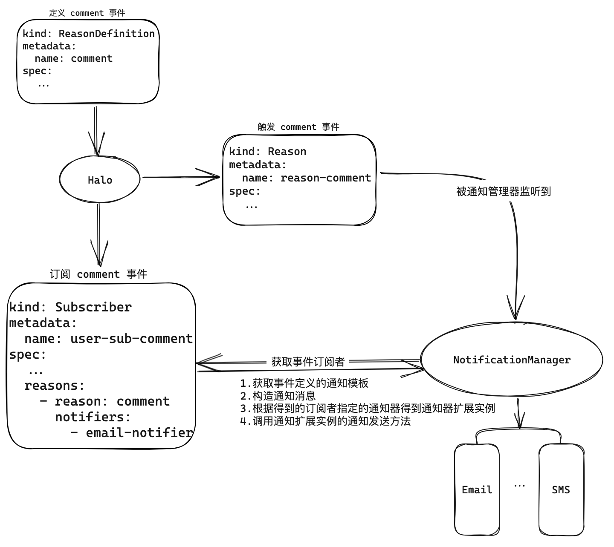
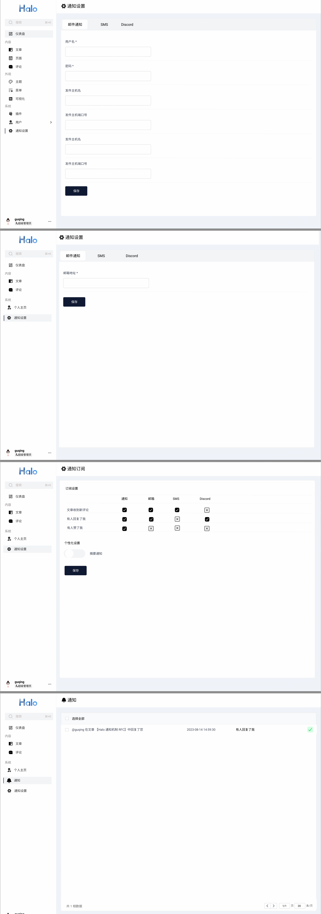

## 背景

在 Halo 系统中，具有用户协作属性，如当用户发布文章后被访客评论而访客希望在作者回复评论时被提醒以此完成进一步互动，而在没有通知功能的情况下无法满足诸如以下描述的使用场景：

1. 访客只能在评论后一段时间内访问被评论的文章查看是否被回复。
2. Halo 的用户注册功能无法让用户验证邮箱地址让恶意注册变的更容易。

在这些场景下，为了让用户收到通知或验证消息以及管理和处理这些通知，我们需要设计一个通知功能，以实现根据用户的订阅和偏好推送通知并管理通知。

## 已有需求

- 访客评论文章后希望收到被回复的通知，而文章作者也希望收到文章被评论的通知。
- 用户注册功能希望验证注册者填写的邮箱实现一个邮箱只能注册一个账号，防止占用别人邮箱，在一定程度上减少恶意注册问题。
- 关于应用市场插件，管理员希望在用户下单后能收到新订单通知。
- 付费订阅插件场景，希望给付费订阅用户推送付费文章的浏览链接。

## 目标

设计一个通知功能，可以根据以下目标，实现订阅和推送通知：

- 支持扩展多种通知方式，例如邮件、短信、Slack 等。
- 支持通知条件并可扩展，例如 Halo
  有新文章发布事件如果用户订阅了新文章发布事件但付费订阅插件决定了此文章只有付费用户才可收到通知、按照付费等级不同决定是否发送新文章通知给对应用户等需要通过实现通知条件的扩展点来满足对应需求。
- 支持定制化选项，例如是否开启通知、通知时段等。
- 支持通知流程，例如通知的发送、接收、查看、标记等。
- 通知内容支持多语言。
- 事件类型可扩展，插件可能需要定义自己的事件以通知到订阅事件的用户，如应用市场插件。

## 非目标

- Halo 只会实现站内消息和邮件通知，更多通知方式需要插件去扩展。
- 定时通知、通知频率或摘要通知功能属于非必要功能，可由插件去扩展。
- 多语言支持，目前只会支持中文和英文两种，更多语言支持不是此阶段的目标。
- 可定制的通知模板：通知默认模板由事件定义者提供，如需修改可考虑使用特定的 Notifier 去适配事件。

## 方案

为了实现上述目标，我们设计了以下方案：

### 通知数据模型

#### 通知事件类别和事件

首先通过定义事件来声明此通知事件包含的数据和发送此事件时默认使用的模板。

`ReasonType` 是一个自定义模型，用于定义事件类别，一个事件类别由多个事件表示。

```yaml
apiVersion: notification.halo.run/v1alpha1
kind: ReasonType
metadata:
  name: comment
spec:
  displayName: "Comment Received"
  description: "The user has received a comment on an post."
  properties:
    - name: postName
      type: string
      description: "The name of the post."
      optional: false
    - name: postTitle
      type: string
      optional: true
    - name: commenter
      type: string
      description: "The email address of the user who has left the comment."
      optional: false
    - name: comment
      type: string
      description: "The content of the comment."
      optional: false
```

`Reason` 是一个自定义模型，用于定义通知原因，它属于 `ReasonType` 的实例。

当有事件触发时，创建 `Reason` 资源来触发通知，如当文章收到一个新评论时：

```yaml
apiVersion: notification.halo.run/v1alpha1
kind: Reason
metadata:
  name: comment-axgu
spec:
  # a name of ReasonType
  reasonType: comment
  author: 'guqing'
  subject:
    apiVersion: 'content.halo.run/v1alpha1'
    kind: Post
    name: 'post-axgu'
    title: 'Hello World'
    url: 'https://guqing.xyz/archives/1'
  attributes:
    postName: "post-fadp"
    commenter: "guqing"
    comment: "Hello! This is your first notification."
```

#### Subscription

`Subscription` 自定义模型，定义了特定事件时与要被通知的订阅者之间的关系, 其中 `subscriber`
表示订阅者用户, `unsubscribeToken` 表示退订时的身份验证 token, `reason` 订阅者感兴趣的事件。

用户可以通过 `Subscription` 来订阅自己感兴趣的事件，当事件触发时会收到通知：

```yaml
apiVersion: notification.halo.run/v1alpha1
kind: Subscription
metadata:
  name: user-a-sub
spec:
  subscriber:
    name: guqing
  unsubscribeToken: xxxxxxxxxxxx
  reason:
    reasonType: new-comment-on-post
    subject:
      apiVersion: content.halo.run/v1alpha1
      kind: Post
      name: 'post-axgu'
    # expression: 'props.owner == "guqing"'
```

- `spec.reason.subject`：用于根据事件的主体的匹配感兴趣的事件，如果不指定 name 则表示匹配主体与 kind 和 apiVersion
  相同的一类事件。
- `spec.expression`：根据表达式匹配感兴趣的事件，例如 `props.owner == "guqing"` 表示只有当事件的属性（reason attributes）的
  owner 等于 guqing 时才会触发通知。表达式符合 SpEL
  表达式语法，但结果只能是布尔值。参考：[增强 Subscription 模型以支持表达式匹配](https://github.com/halo-dev/halo/issues/5632)

> 当 `spec.expression` 和 `spec.reason.subject` 同时存在时，以 `spec.reason.subject` 的结果为准，不建议同时使用。

订阅退订链接 API
规则：`/apis/api.notification.halo.run/v1alpha1/subscriptions/{name}/unsubscribe?token={unsubscribeToken}`。

#### 用户通知偏好设置

通过在用户偏好设置的 ConfigMap 中存储一个 `notification` key 用于保存事件类型与通知方式的关系设置，当用户订阅了如 '
new-comment-on-post' 事件时会获取对应的通知方式来给用户发送通知。

```yaml
apiVersion: v1alpha1
kind: ConfigMap
metadata:
  name: user-preferences-guqing
data:
  notification: |
    {
      reasonTypeNotification: {
        'new-comment-on-post': {
          enabled: true,
          notifiers: [
            email-notifier,
            sms-notifier
          ]
        },
        new-post: {
          enabled: true,
          notifiers: [
            email-notifier,
            webhook-router-notifier
          ]
        }
      },
    }
```

#### Notification 站内通知

当用户订阅到事件后会创建 `Notification`, 它与通知方式（notifier）无关，`recipient` 为用户名，类似站内通知，如用户 `guqing`
订阅了评论事件那么当监听到评论事件时会创建一条记录可以在个人中心的通知列表看到一条通知消息。

```yaml
apiVersion: notification.halo.run/v1alpha1
kind: Notification
metadata:
  name: notification-abc
spec:
  # username
  recipient: "guqing"
  reason: 'comment-axgu'
  title: 'notification-title'
  rawContent: 'notification-raw-body'
  htmlContent: 'notification-html'
  unread: true
  lastReadAt: '2023-08-04T17:01:45Z'
```

个人中心通知自定义 APIs:

1. 获取个人中心获取用户通知列表的 APIs 规则：
   `GET /apis/api.notification.halo.run/v1alpha1/userspaces/{username}/notifications`
2. 将通知标记为已读：`PUT /apis/api.notification.halo.run/v1alpha1/userspaces/{username}/notifications/mark-as-read`
3.

批量将通知标记为已读：`PUT /apis/api.notification.halo.run/v1alpha1/userspaces/{username}/notifications/mark-specified-as-read`

#### 通知模板

`NotificationTemplate` 自定义模型用于定义事件的通知模板，当事件触发时会根据事件的通知模板来渲染通知内容。
它通过定义 `reasonSelector` 来引用事件类别，当事件触发时会根据用户的语言偏好和触发事件的类别来选择一个最佳的通知模板。
选择通知模板的规则为：

1. 根据用户设置的语言，选择从通知模板中定义的 `spec.reasonSelector.language` 的值从更具体到不太具体的顺序（例如，gl_ES 的值将比
   gl 的值具有更高的优先级）。
2. 当通过语言成功匹配到模板时，匹配到的结果可能不止一个，如 `language` 为 `zh_CN`
   的模板有三个那么会根据 `NotificationTemplate` 的 `metadata.creationTimestamp` 字段来选择一个最新的模板。

这样的规则有助于用户可以个性化定制某些事件的模板内容。

模板语法使用 ThymeleafEngine 渲染，纯文本模板使用 `textual`
模板模式，语法参考: [usingthymeleaf.html#textual-syntax](https://www.thymeleaf.org/doc/tutorials/3.1/usingthymeleaf.html#textual-syntax)

`HTML`
则使用标准表达式语法在标签属性中取值，语法参考：[standard-expression-syntax](https://www.thymeleaf.org/doc/tutorials/3.1/usingthymeleaf.html#standard-expression-syntax)

在通知中心渲染模板时会在 `ReasonAttributes` 中提供额外属性包括：

- site.title: 站点标题
- site.subtitle: 站点副标题
- site.logo: 站点 LOGO
- site.url: 站点访问地址
- subscriber.id: 如果是用户则为用户名, 如果是匿名用户则为 `annoymousUser#email`
- subscriber.displayName: 邮箱地址或`@username`
- unsubscribeUrl: 退订链接，用于取消订阅

因此，任何模板都可以使用这几个属性，但事件定义者需要注意避免使用这些保留属性。

```yaml
apiVersion: notification.halo.run/v1alpha1
kind: NotificationTemplate
metadata:
  name: template-new-comment-on-post
spec:
  reasonSelector:
    reasonType: new-comment-on-post
    language: zh_CN
  template:
    title: "你的文章 [(${postTitle})] 收到了一条新评论"
    body: |
      [(${commenter})] 评论了你的文章 [(${postTitle})]，内容如下：
      [(${comment})]
```

#### 通知器声明及扩展

`NotifierDescriptor` 自定义模型用于声明通知器，通过它来描述通知器的名称、描述和关联的 `ExtensionDefinition`
名称，让用户可以在用户界面知道通知器是什么以及它可以做什么,
还让 NotificationCenter 知道如何加载通知器和准备通知器需要的设置以发送通知。

```yaml
apiVersion: notification.halo.run/v1alpha1
kind: NotifierDescriptor
metadata:
  name: email-notifier
spec:
  displayName: '邮件通知器'
  description: '支持通过邮件的方式发送通知。'
  notifierExtName: '通知对应的扩展名称'
  senderSettingRef:
    name: 'email-notifier'
    group: 'sender'
  receiverSettingRef:
    name: 'email-notifier'
    group: 'receiver'
```

通知器声明了 senderSettingRef 和 receiverSettingRef 后，对应用户端可以通过以下 APIs 获取和保存配置：

管理员获取和保存通知器发送配置的 APIs:

1. 获取通知器发送方配置：`GET /apis/api.console.halo.run/v1alpha1/notifiers/{name}/sender-config`
2. 保存通知器发送方配置：`POST /apis/api.console.halo.run/v1alpha1/notifiers/{name}/sender-config`

个人中心用户获取和保存对应通知器接收消息配置的 APIs:

1. 获取通知器接收消息配置：`GET /apis/api.notification.halo.run/v1alpha1/notifiers/{name}/receiver-config`
2. 获取通知器接收消息配置：`POST /apis/api.notification.halo.run/v1alpha1/notifiers/{name}/receiver-config`

通知器扩展点用于实现发送通知的方式：

```java
public interface ReactiveNotifier extends ExtensionPoint {

  /**
   * Notify user.
   *
   * @param context notification context must not be null
   */
  Mono<Void> notify(NotificationContext context);
}

@Data
public class NotificationContext {
  private Message message;

  private ObjectNode receiverConfig;

  private ObjectNode senderConfig;

  @Data
  static class Message {
    private MessagePayload payload;

    private Subject subject;

    private String recipient;

    private Instant timestamp;
  }

  @Data
  public static class Subject {
    private String apiVersion;
    private String kind;
    private String name;
    private String title;
    private String url;
  }

  @Data
  static class MessagePayload {
    private String title;

    private String rawBody;

    private String htmlBody;

    private ReasonAttributes attributes;
  }
}
```

通知数据结构交互图



通知功能 UI 设计


### 通知模块功能

- 发送通知：当触发通知事件时，系统会根据 subscriber 的偏好设置获取到事件对应的通知方式再根据偏好设置自动发送通知。
- 接收通知：用户可以选择接收通知的方式，例如邮件、短信、自定义路由通知等。
- 查看通知：用户可以在 Halo 中查看所有的通知，包括已读和未读的通知。
- 标记通知：用户可以标记通知为已读或未读状态，以便更好地管理和处理通知。

### 通知管理列表条件筛选

我们支持以下通知条件筛选策略：

- 按事件类型：列出特定类型的事件通知，例如新文章，新评论、状态更新等。
- 按已读状态：根据通知是否已读列出，方便用户查看未读通知。
- 按关键词：列出通知中包含特定关键词的事件通知，例如包含用户名称、标题等关键词的通知。
- 按时间：列出在特定时间段内发生的事件通知，例如最近一周、最近一个月等时间段内的通知。

### 定制化选项

如果后续有足够的使用场景，可以考虑支持以下定制化选项：

- 通知时间段：用户可以设置通知的时间段，例如只在工作时间内推送通知。
- 通知频率：用户可以设置通知的频率，例如每天、每周、每月等。
- 摘要通知：用户可以设置接收每周摘要，总结一周内的通知合并为一条通知并通过如邮件等方式接收。

## 结论

通过以上方案和实现，我们设计了一个通知功能，可以根据用户的需求和偏好，自动筛选和推送通知。同时，为了支持更多的事件类型、通知方式和通知条件筛选策略，系统具有良好的可扩展性。
