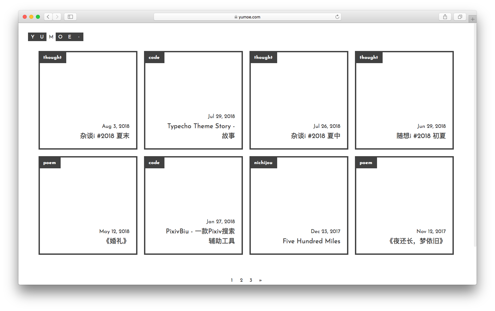
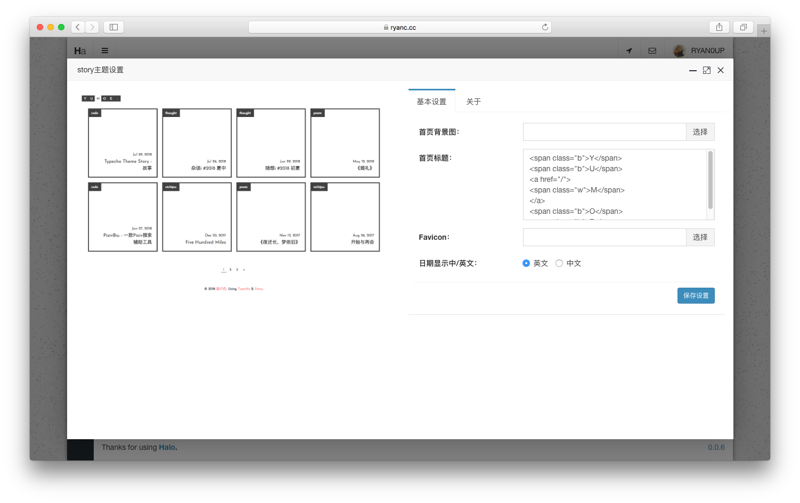

<h1><a href="#" target="_blank">Story-Halo</a></h1>

> 一款Halo的主题，简约，小清新。

## 说明

该主题的原作者为[Trii Hsia](https://github.com/txperl)，非常感谢做出这么优秀的主题。

原主题地址：[https://github.com/txperl/Story-for-Typecho](https://github.com/txperl/Story-for-Typecho)

## 预览截图

## 预览地址

[森の色](https://yumoe.com/)

## 注意

该主题能渲染`首页(/)`，`文章页(/archives/${postUrl})`，`标签页(/tags)`，`分类目录(/categories)`，`归档(/archives)`，`友情链接(/links)`，`自定义页面(/p/${postUrl})`。

## 使用方法

克隆或者[下载](https://github.com/ruibaby/story-halo/releases)，将文件夹名改为`story`，压缩为zip压缩包之后在后台的主题设置直接上传即可使用。

