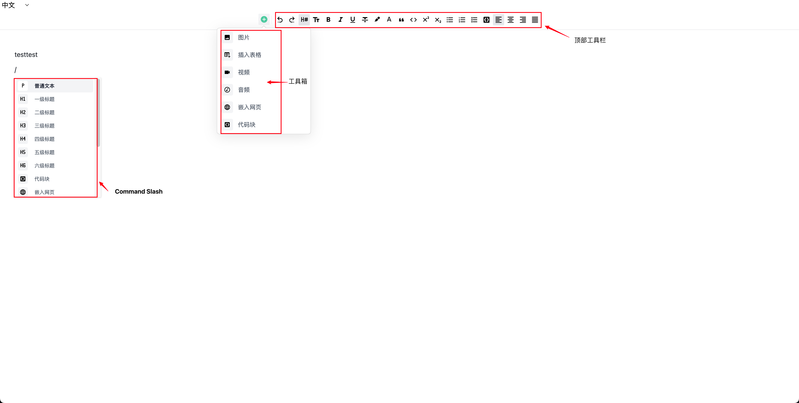

# 扩展说明

本文档介绍如何对编辑器的功能进行扩展，包括但不限于扩展工具栏、悬浮工具栏、Slash Command、拖拽功能等。各扩展区域参考下图：



目前支持的所有扩展类型 [ExtensionOptions](../packages/editor/src/types/index.ts) 如下所示：

```ts
export interface ExtensionOptions {
  // 顶部工具栏扩展
  getToolbarItems?: ({
    editor,
  }: {
    editor: Editor;
  }) => ToolbarItem | ToolbarItem[];

  // Slash Command 扩展
  getCommandMenuItems?: () => CommandMenuItem | CommandMenuItem[];

  // 悬浮菜单扩展
  getBubbleMenu?: ({ editor }: { editor: Editor }) => NodeBubbleMenu;

  // 工具箱扩展
  getToolboxItems?: ({
    editor,
  }: {
    editor: Editor;
  }) => ToolboxItem | ToolboxItem[];

  // 拖拽扩展
  getDraggable?: ({ editor }: { editor: Editor }) => DraggableItem | boolean;
}
```

> 对于 Tiptap 本身的扩展方式可以参考 <https://tiptap.dev/api/introduction>

## 1. 顶部工具栏扩展

编辑器顶部功能区域内容的扩展，通常用于增加用户常用操作，例如文本加粗、变更颜色等。

在 <https://github.com/halo-sigs/richtext-editor/pull/16> 中，我们实现了对顶部工具栏的扩展，如果需要添加额外的功能，只需要在具体的 Tiptap Extension 中的 `addOptions` 中定义 `getToolbarItems` 函数即可，如：

```ts
{
  addOptions() {
    return {
      ...this.parent?.(),
      getToolbarItems({ editor }: { editor: Editor }) {
        return []
      },
    };
  },
}
```

其中 `getToolbarItems` 即为对顶部工具栏的扩展。其返回类型为：

```ts
// 顶部工具栏扩展
getToolbarItems?: ({
  editor,
}: {
  editor: Editor;
}) => ToolbarItem | ToolbarItem[];

// 工具栏
export interface ToolbarItem {
  priority: number;
  component: Component;
  props: {
    editor: Editor;
    isActive: boolean;
    disabled?: boolean;
    icon?: Component;
    title?: string;
    action?: () => void;
  };
  children?: ToolbarItem[];
}
```

如下为 [`Bold`](../packages/editor/src/extensions/bold/index.ts) 扩展中对于 `getToolbarItems` 的扩展示例：

```ts
addOptions() {
  return {
    ...this.parent?.(),
    getToolbarItems({ editor }: { editor: Editor }) {
      return {
        priority: 40,
        component: markRaw(ToolbarItem),
        props: {
          editor,
          isActive: editor.isActive("bold"),
          icon: markRaw(MdiFormatBold),
          title: i18n.global.t("editor.common.bold"),
          action: () => editor.chain().focus().toggleBold().run(),
        },
      };
    },
  };
},
```

## 2. 工具箱扩展

编辑器工具箱区域的扩展，可用于增加编辑器附属操作，例如插入表格，插入第三方组件等功能。

在 <https://github.com/halo-sigs/richtext-editor/pull/27> 中，我们实现了对编辑器工具箱区域的扩展，如果需要添加额外的功能，只需要在具体的 Tiptap Extension 中的 `addOptions` 中定义 `getToolboxItems` 函数即可，如：

```ts
{
  addOptions() {
    return {
      ...this.parent?.(),
      getToolboxItems({ editor }: { editor: Editor }) {
        return []
      },
    };
  },
}
```

其中 `getToolboxItems` 即为对工具箱的扩展。其返回类型为：

```ts
// 工具箱扩展
getToolboxItems?: ({
  editor,
}: {
  editor: Editor;
}) => ToolboxItem | ToolboxItem[];

export interface ToolboxItem {
  priority: number;
  component: Component;
  props: {
    editor: Editor;
    icon?: Component;
    title?: string;
    description?: string;
    action?: () => void;
  };
}
```

如下为 [`Table`](../packages/editor/src/extensions/table/index.ts) 扩展中对于 `getToolboxItems` 工具箱的扩展示例：

```ts
addOptions() {
  return {
    ...this.parent?.(),
    getToolboxItems({ editor }: { editor: Editor }) {
      return {
        priority: 15,
        component: markRaw(ToolboxItem),
        props: {
          editor,
          icon: markRaw(MdiTablePlus),
          title: i18n.global.t("editor.menus.table.add"),
          action: () =>
            editor
              .chain()
              .focus()
              .insertTable({ rows: 3, cols: 3, withHeaderRow: true })
              .run(),
        },
      };
    },
  }
}
```

## 3. Slash Command 扩展

Slash Command （斜杠命令）的扩展，可用于在当前行快捷执行功能操作，例如转换当前行为标题、在当前行添加代码块等功能。

在 <https://github.com/halo-sigs/richtext-editor/pull/16> 中，我们实现了对 Slash Command 指令的扩展，如果需要添加额外的功能，只需要在具体的 Tiptap Extension 中的 `addOptions` 中定义 `getCommandMenuItems` 函数即可，如：

```ts
{
  addOptions() {
    return {
      ...this.parent?.(),
      getCommandMenuItems() {
        return []
      },
    };
  },
}
```

其中 `getCommandMenuItems` 即为对工具箱的扩展。其返回类型为：

```ts
// Slash Command 扩展
getCommandMenuItems?: () => CommandMenuItem | CommandMenuItem[];

export interface CommandMenuItem {
  priority: number;
  icon: Component;
  title: string;
  keywords: string[];
  command: ({ editor, range }: { editor: Editor; range: Range }) => void;
}
```

如下为 [`Table`](../packages/editor/src/extensions/table/index.ts) 扩展中对于 `getCommandMenuItems` 的扩展示例：

```ts
  addOptions() {
    return {
      ...this.parent?.(),
      getCommandMenuItems() {
        return {
          priority: 120,
          icon: markRaw(MdiTable),
          title: "editor.extensions.commands_menu.table",
          keywords: ["table", "biaoge"],
          command: ({ editor, range }: { editor: Editor; range: Range }) => {
            editor
              .chain()
              .focus()
              .deleteRange(range)
              .insertTable({ rows: 3, cols: 3, withHeaderRow: true })
              .run();
          },
        };
      },
    }
  }
```

## 4. 悬浮菜单扩展

编辑器悬浮菜单的扩展。可用于支持目标元素组件的功能扩展及操作简化。例如 `Table` 扩展中的添加下一列、添加上一列等操作。

在 <https://github.com/halo-sigs/richtext-editor/pull/38> 中，我们重构了对编辑器悬浮区域的扩展，如果需要对某个块进行支持，只需要在具体的 Tiptap Extension 中的 `addOptions` 中定义 `getBubbleMenu` 函数即可，如：

```ts
{
  addOptions() {
    return {
      ...this.parent?.(),
      getBubbleMenu({ editor }: { editor: Editor }) {
        return []
      },
    };
  },
}
```

其中 `getBubbleMenu` 即为对悬浮菜单的扩展。其返回类型为：

```ts
// 悬浮菜单扩展
getBubbleMenu?: ({ editor }: { editor: Editor }) => NodeBubbleMenu;

interface BubbleMenuProps {
  pluginKey?: string;                                             // 悬浮菜单插件 Key，建议命名方式 xxxBubbleMenu
  editor?: Editor;
  shouldShow: (props: {                                           // 悬浮菜单显示的条件
    editor: Editor;
    node?: HTMLElement;
    view?: EditorView;
    state?: EditorState;
    oldState?: EditorState;
    from?: number;
    to?: number;
  }) => boolean;
  tippyOptions?: Record<string, unknown>;                          // 可自由定制悬浮菜单所用的 tippy 组件的选项
  getRenderContainer?: (node: HTMLElement) => HTMLElement;         // 悬浮菜单所基准的 DOM
  defaultAnimation?: boolean;                                      // 是否启用默认动画。默认为 true
}

// 悬浮菜单
export interface NodeBubbleMenu extends BubbleMenuProps {
  component?: Component;                                           // 不使用默认的样式，与 items 二选一
  items?: BubbleItem[];                                            // 悬浮菜单子项，使用默认的形式进行，与 items 二选一
}

// 悬浮菜单子项
export interface BubbleItem {
  priority: number;                                                // 优先级，数字越小优先级越大，越靠前
  component?: Component;                                           // 完全自定义子项样式
  props: {
    isActive: ({ editor }: { editor: Editor }) => boolean;         // 当前功能是否已经处于活动状态
    visible?: ({ editor }: { editor: Editor }) => boolean;         // 是否显示当前子项
    icon?: Component;                                              // 图标
    iconStyle?: string;                                            // 图标自定义样式
    title?: string;                                                // 标题
    action?: ({ editor }: { editor: Editor }) => Component | void; // 点击子项后的操作，如果返回 Component，则会将其包含在下拉框中。
  };
}
```

如下为 [`Table`](../packages/editor/src/extensions/table/index.ts) 扩展中对于 `getBubbleMenu` 悬浮菜单的部分扩展示例：

```ts
addOptions() {
  return {
    ...this.parent?.(),
      getBubbleMenu({ editor }) {
        return {
          pluginKey: "tableBubbleMenu",
          shouldShow: ({ state }: { state: EditorState }): boolean => {
            return isActive(state, Table.name);
          },
          getRenderContainer(node) {
            let container = node;
            if (container.nodeName === "#text") {
              container = node.parentElement as HTMLElement;
            }
            while (
              container &&
              container.classList &&
              !container.classList.contains("tableWrapper")
            ) {
              container = container.parentElement as HTMLElement;
            }
            return container;
          },
          tippyOptions: {
            offset: [26, 0],
          },
          items: [
            {
              priority: 10,
              props: {
                icon: markRaw(MdiTableColumnPlusBefore),
                title: i18n.global.t("editor.menus.table.add_column_before"),
                action: () => editor.chain().focus().addColumnBefore().run(),
              },
            },
          ]
        }
      }
  }
}
```

## 5. 拖拽功能扩展

拖拽功能的扩展，可用于支持当前块元素的拖拽功能。

在 <https://github.com/halo-sigs/richtext-editor/pull/48> 中，我们实现了对所有元素的拖拽功能，如果需要让当前扩展支持拖拽，只需要在具体的 Tiptap Extension 中的 `addOptions` 中定义 `getDraggable` 函数，并让其返回 true 即可。如：

```ts
{
  addOptions() {
    return {
      ...this.parent?.(),
      getDraggable() {
        return true;
      },
    };
  },
}
```

其中 `getDraggable` 即为为当前扩展增加可拖拽的功能。其返回类型为：

```ts
// 拖拽扩展
getDraggable?: ({ editor }: { editor: Editor }) => DraggableItem | boolean;

export interface DraggableItem {
  getRenderContainer?: ({               // 拖拽按钮计算偏移位置的基准 DOM
    dom,
    view,
  }: {
    dom: HTMLElement;
    view: EditorView;
  }) => DragSelectionNode;
  handleDrop?: ({                       // 完成拖拽功能之后的处理。返回 true 则会阻止拖拽的发生
    view,
    event,
    slice,
    insertPos,
    node,
    selection,
  }: {
    view: EditorView;
    event: DragEvent;
    slice: Slice;
    insertPos: number;
    node: Node;
    selection: Selection;
  }) => boolean | void;
  allowPropagationDownward?: boolean;   // 是否允许拖拽事件向内部传播，
}

export interface DragSelectionNode {
  $pos?: ResolvedPos;
  node?: Node;
  el: HTMLElement;
  nodeOffset?: number;
  dragDomOffset?: {
    x: number;
    y: number;
  };
}
```

> 拖拽会从父 Node 节点开始触发，直到找到一个实现 `getDraggable` 的扩展，如果没有找到，则不会触发拖拽事件。父 Node 可以通过 `allowPropagationDownward` 来控制是否允许拖拽事件向内部传播。如果 `allowPropagationDownward` 设置为 true，则会继续向内部寻找实现 `getDraggable` 的扩展，如果没有找到，则触发父 Node 的 `getDraggable` 实现，否则继续进行传播。

如下为 [`Iframe`](../packages/editor/src/extensions/iframe/index.ts) 扩展中对于 `getDraggable` 拖拽功能的扩展示例：

```ts
addOptions() {
  return {
    ...this.parent?.(),
    getDraggable() {
      return {
        getRenderContainer({ dom, view }) {
          let container = dom;
          while (
            container.parentElement &&
            container.parentElement.tagName !== "P"
          ) {
            container = container.parentElement;
          }
          if (container) {
            container = container.firstElementChild
              ?.firstElementChild as HTMLElement;
          }
          let node;
          if (container.firstElementChild) {
            const pos = view.posAtDOM(container.firstElementChild, 0);
            const $pos = view.state.doc.resolve(pos);
            node = $pos.node();
          }

          return {
            node: node,
            el: container as HTMLElement,
          };
        },
      };
    },
  }
}
```
