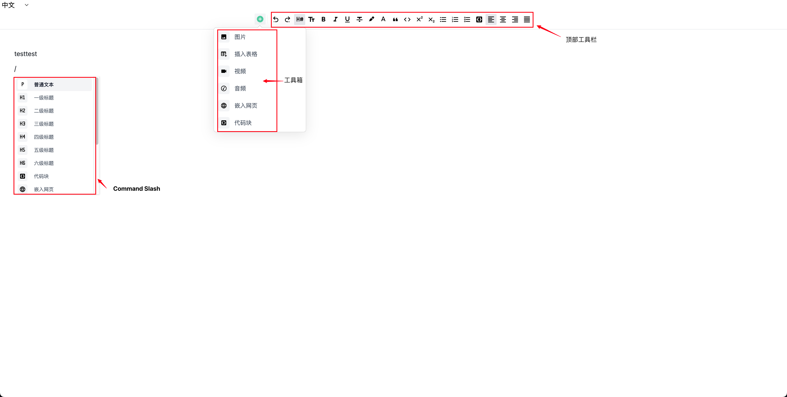

# 扩展说明

本文档介绍如何对编辑器的功能进行扩展，包括但不限于扩展工具栏、悬浮工具栏、Slash Command、拖拽功能等。各扩展区域参考下图：



目前支持的所有扩展类型 [ExtensionOptions](../packages/editor/src/types/index.ts) 如下所示：

```ts
export interface ExtensionOptions {
  // 顶部工具栏扩展
  getToolbarItems?: ({
    editor,
  }: {
    editor: Editor;
  }) => ToolbarItemType | ToolbarItemType[];

  // Slash Command 扩展
  getCommandMenuItems?: () => CommandMenuItemType | CommandMenuItemType[];

  // 悬浮菜单扩展
  getBubbleMenu?: ({ editor }: { editor: Editor }) => NodeBubbleMenuType;

  // 工具箱扩展
  getToolboxItems?: ({
    editor,
  }: {
    editor: Editor;
  }) => ToolboxItemType | ToolboxItemType[];

  // 拖拽菜单扩展
  getDraggableMenuItems?: ({
    editor,
  }: {
    editor: Editor;
  }) => DragButtonType | DragButtonType[];
}
```

> 对于 Tiptap 本身的扩展方式可以参考 <https://tiptap.dev/api/introduction>

## 1. 顶部工具栏扩展

编辑器顶部功能区域内容的扩展，通常用于增加用户常用操作，例如文本加粗、变更颜色等。

在 <https://github.com/halo-sigs/richtext-editor/pull/16> 中，我们实现了对顶部工具栏的扩展，如果需要添加额外的功能，只需要在具体的 Tiptap Extension 中的 `addOptions` 中定义 `getToolbarItems` 函数即可，如：

```ts
{
  addOptions() {
    return {
      ...this.parent?.(),
      getToolbarItems({ editor }: { editor: Editor }) {
        return []
      },
    };
  },
}
```

其中 `getToolbarItems` 即为对顶部工具栏的扩展。其返回类型为：

```ts
// 顶部工具栏扩展
getToolbarItems?: ({
  editor,
}: {
  editor: Editor;
}) => ToolbarItemType | ToolbarItemType[];

// 工具栏
export interface ToolbarItemType {
  priority: number;
  component: Component;
  props: {
    editor: Editor;
    isActive: boolean;
    disabled?: boolean;
    icon?: Component;
    title?: string;
    shortcutId?: string;
    shortcutIds?: string[];
    action?: () => void;
  };
  children?: ToolbarItemType[];
}
```

如下为 [`Bold`](../packages/editor/src/extensions/bold/index.ts) 扩展中对于 `getToolbarItems` 的扩展示例：

```ts
addOptions() {
  return {
    ...this.parent?.(),
    getToolbarItems({ editor }: { editor: Editor }) {
      return {
        priority: 40,
        component: markRaw(ToolbarItem),
        props: {
          editor,
          isActive: editor.isActive("bold"),
          icon: markRaw(MdiFormatBold),
          title: i18n.global.t("editor.common.bold"),
          action: () => editor.chain().focus().toggleBold().run(),
        },
      };
    },
  };
},
```

## 2. 快捷键与提示信息

Halo 在 Tiptap 的 `addKeyboardShortcuts` 基础上提供了快捷键描述注册表。第三方扩展仍然只需要实现一个 `addKeyboardShortcuts`，同时即可获得以下能力：

- 执行 Tiptap 快捷键命令；
- 在“键盘快捷键”侧边栏中展示操作说明；
- 通过同一个 `shortcutId` 在工具栏或悬浮菜单的 tooltip 中展示快捷键；
- 根据当前操作系统将 `Mod`、`Alt` 等按键格式化为对应的展示形式。

### 2.1 注册快捷键并关联工具栏

使用 `defineHaloKeyboardShortcuts` 定义快捷键，再将相同的 `id` 传给工具栏组件的 `shortcutId`：

```ts
import {
  defineHaloKeyboardShortcuts,
  Extension,
  ToolbarItem,
  type Editor,
  type ExtensionOptions,
} from "@halo-dev/richtext-editor";
import { markRaw } from "vue";
import MyIcon from "./MyIcon.vue";

const shortcutId = "plugin.example.insertGreeting";

function insertGreeting(editor: Editor) {
  return editor.chain().focus().insertContent("Hello Halo").run();
}

export const ExtensionExample = Extension.create<ExtensionOptions>({
  name: "exampleShortcut",

  addKeyboardShortcuts() {
    return defineHaloKeyboardShortcuts(this, [
      {
        id: shortcutId,
        keys: ["Mod-Alt-g"],
        label: "插入问候语",
        category: "general",
        priority: 100,
        command: () => insertGreeting(this.editor),
      },
    ]);
  },

  addOptions() {
    return {
      ...this.parent?.(),
      getToolbarItems({ editor }: { editor: Editor }) {
        return {
          priority: 100,
          component: markRaw(ToolbarItem),
          props: {
            editor,
            isActive: false,
            icon: markRaw(MyIcon),
            title: "插入问候语",
            shortcutId,
            action: () => insertGreeting(editor),
          },
        };
      },
    };
  },
});
```

`ToolbarItem`、`ToolbarSubItem` 和 `BubbleItem` 都支持 `shortcutId`。`ToolbarItem` 还支持 `shortcutIds`，适用于一个按钮对应多个操作的情况，例如同时展示“增大字号”和“减小字号”。tooltip 会展示每个快捷键定义中的第一组按键，快捷键侧边栏则会展示 `keys` 中的全部可选按键。

默认编辑器已经通过 `ExtensionsKit` 内置 `ExtensionKeyboardShortcuts`，插件通过 `default:editor:extension:create` 扩展点注册时无需重复添加。自行创建编辑器实例时，应使用 `ExtensionsKit`，或显式加入 `ExtensionKeyboardShortcuts`。

### 2.2 描述字段

`defineHaloKeyboardShortcuts` 接收的每一项都是一个 `HaloKeyboardShortcutDefinition`：

| 字段 | 必填 | 说明 |
| --- | --- | --- |
| `id` | 是 | 编辑器内稳定且唯一的标识符，用于关联 tooltip。插件应使用包含插件标识的命名空间，例如 `plugin.example.insertGreeting`。 |
| `keys` | 是 | Tiptap 格式的按键组合。第一项是 tooltip 展示的主快捷键，全部按键都会展示在快捷键侧边栏中。 |
| `label` | 是 | 用户可见的操作名称，可以是字符串或返回字符串的函数。 |
| `category` | 是 | 快捷键侧边栏分组：`general`、`formatting`、`structure` 或 `navigation`。 |
| `command` | 视情况 | 新增快捷键时必须提供。扩展已有 Tiptap 快捷键时可以省略，此时复用父扩展中相同按键的命令。 |
| `description` | 否 | 操作的补充说明，可以是字符串或返回字符串的函数。 |
| `priority` | 否 | 在快捷键侧边栏同一分组中的排序值，数值越小越靠前，默认为 `100`。 |
| `discoverable` | 否 | 是否出现在快捷键侧边栏中，默认为 `true`。即使设为 `false`，显式绑定了 `shortcutId` 的 tooltip 仍可展示。 |
| `visible` | 否 | 根据当前编辑器状态决定是否出现在快捷键侧边栏中。 |

按键名称遵循 [Tiptap 快捷键格式](https://tiptap.dev/docs/editor/core-concepts/keyboard-shortcuts)。建议使用 `Mod` 表示 macOS 的 `Command` 和 Windows/Linux 的 `Control`，例如 `Mod-b`。命令处理成功时应返回 `true`，这样 ProseMirror 会阻止浏览器继续执行同一按键的默认行为；未处理时应返回 `false`。

如果扩展继承的 Tiptap 扩展已经实现了相同按键，可以只补充 Halo 的描述信息，不需要重新实现命令：

```ts
addKeyboardShortcuts() {
  return defineHaloKeyboardShortcuts(this, [
    {
      id: "plugin.example.toggleFeature",
      keys: ["Mod-b"],
      label: "切换示例功能",
      category: "formatting",
    },
  ]);
},
```

只有父扩展确实定义了 `keys` 中对应的按键时才能省略 `command`。开发环境会对缺少实际命令的定义输出警告，并且不会注册这条描述。

### 2.3 自定义组件中的 tooltip

完全自定义工具栏组件时，可以通过 `useHaloKeyboardShortcut` 响应式读取注册表，再使用 `KeyboardShortcutTooltip` 保持与内置工具栏一致的视觉和无障碍信息：

```vue
<script setup lang="ts">
import {
  KeyboardShortcutTooltip,
  useHaloKeyboardShortcut,
  type Editor,
} from "@halo-dev/richtext-editor";

const props = defineProps<{
  editor: Editor;
  shortcutId: string;
  title: string;
}>();

const shortcut = useHaloKeyboardShortcut(props.editor, () => props.shortcutId);
</script>

<template>
  <KeyboardShortcutTooltip
    v-slot="tooltipProps"
    :title="title"
    :shortcut="shortcut?.keys[0]"
  >
    <button :aria-label="tooltipProps.ariaLabel" type="button">
      {{ title }}
    </button>
  </KeyboardShortcutTooltip>
</template>
```

一个组件需要读取多条快捷键时，可以使用 `useHaloKeyboardShortcuts(editor, () => shortcutIds)`。这两个 composable 必须在 Vue 组件的 `setup` 阶段调用，以便组件卸载时自动取消注册表订阅。

### 2.4 命名与冲突规则

- `id` 应包含插件标识，避免覆盖其他扩展注册的描述；快捷键注册表不会自动为重复 ID 添加命名空间。
- 只注册产品中真实可执行的快捷键，不要为了填满快捷键侧边栏而自行创造按键组合。
- 添加按键前应检查 Halo 默认快捷键、Tiptap 默认快捷键以及浏览器常用快捷键。确实需要覆盖浏览器默认行为时，命令必须在成功处理后返回 `true`。
- `label` 和 `description` 应面向用户描述操作，不要使用内部命令名或扩展名。

## 3. 工具箱扩展

编辑器工具箱区域的扩展，可用于增加编辑器附属操作，例如插入表格，插入第三方组件等功能。

在 <https://github.com/halo-sigs/richtext-editor/pull/27> 中，我们实现了对编辑器工具箱区域的扩展，如果需要添加额外的功能，只需要在具体的 Tiptap Extension 中的 `addOptions` 中定义 `getToolboxItems` 函数即可，如：

```ts
{
  addOptions() {
    return {
      ...this.parent?.(),
      getToolboxItems({ editor }: { editor: Editor }) {
        return []
      },
    };
  },
}
```

其中 `getToolboxItems` 即为对工具箱的扩展。其返回类型为：

```ts
// 工具箱扩展
getToolboxItems?: ({
  editor,
}: {
  editor: Editor;
}) => ToolboxItemType | ToolboxItemType[];

export interface ToolboxItemType {
  priority: number;
  component: Component;
  props: {
    editor: Editor;
    icon?: Component;
    title?: string;
    description?: string;
    action?: () => void;
  };
}
```

如下为 [`Table`](../packages/editor/src/extensions/table/index.ts) 扩展中对于 `getToolboxItems` 工具箱的扩展示例：

```ts
addOptions() {
  return {
    ...this.parent?.(),
    getToolboxItems({ editor }: { editor: Editor }) {
      return {
        priority: 15,
        component: markRaw(ToolboxItem),
        props: {
          editor,
          icon: markRaw(MdiTablePlus),
          title: i18n.global.t("editor.menus.table.add"),
          action: () =>
            editor
              .chain()
              .focus()
              .insertTable({ rows: 3, cols: 3, withHeaderRow: true })
              .run(),
        },
      };
    },
  }
}
```

## 4. Slash Command 扩展

Slash Command （斜杠命令）的扩展，可用于在当前行快捷执行功能操作，例如转换当前行为标题、在当前行添加代码块等功能。

在 <https://github.com/halo-sigs/richtext-editor/pull/16> 中，我们实现了对 Slash Command 指令的扩展，如果需要添加额外的功能，只需要在具体的 Tiptap Extension 中的 `addOptions` 中定义 `getCommandMenuItems` 函数即可，如：

```ts
{
  addOptions() {
    return {
      ...this.parent?.(),
      getCommandMenuItems() {
        return []
      },
    };
  },
}
```

其中 `getCommandMenuItems` 即为对工具箱的扩展。其返回类型为：

```ts
// Slash Command 扩展
getCommandMenuItems?: () => CommandMenuItemType | CommandMenuItemType[];

export interface CommandMenuItemType {
  priority: number;
  icon: Component;
  title: string;
  keywords: string[];
  command: ({ editor, range }: { editor: Editor; range: Range }) => void;
}
```

如下为 [`Table`](../packages/editor/src/extensions/table/index.ts) 扩展中对于 `getCommandMenuItems` 的扩展示例：

```ts
  addOptions() {
    return {
      ...this.parent?.(),
      getCommandMenuItems() {
        return {
          priority: 120,
          icon: markRaw(MdiTable),
          title: "editor.extensions.commands_menu.table",
          keywords: ["table", "biaoge"],
          command: ({ editor, range }: { editor: Editor; range: Range }) => {
            editor
              .chain()
              .focus()
              .deleteRange(range)
              .insertTable({ rows: 3, cols: 3, withHeaderRow: true })
              .run();
          },
        };
      },
    }
  }
```

## 5. 悬浮菜单扩展

编辑器悬浮菜单的扩展。可用于支持目标元素组件的功能扩展及操作简化。例如 `Table` 扩展中的添加下一列、添加上一列等操作。

在 <https://github.com/halo-sigs/richtext-editor/pull/38> 中，我们重构了对编辑器悬浮区域的扩展，如果需要对某个块进行支持，只需要在具体的 Tiptap Extension 中的 `addOptions` 中定义 `getBubbleMenu` 函数即可，如：

```ts
{
  addOptions() {
    return {
      ...this.parent?.(),
      getBubbleMenu({ editor }: { editor: Editor }) {
        return []
      },
    };
  },
}
```

其中 `getBubbleMenu` 即为对悬浮菜单的扩展。其返回类型为：

```ts
// 悬浮菜单扩展
getBubbleMenu?: ({ editor }: { editor: Editor }) => NodeBubbleMenuType;

interface BubbleMenuProps {
  pluginKey?: string;                                             // 悬浮菜单插件 Key，建议命名方式 xxxBubbleMenu
  editor?: Editor;
  shouldShow: (props: {                                           // 悬浮菜单显示的条件
    editor: Editor;
    state: EditorState;
    node?: HTMLElement;
    view?: EditorView;
    oldState?: EditorState;
    from?: number;
    to?: number;
  }) => boolean;
  tippyOptions?: Record<string, unknown>;                          // 可自由定制悬浮菜单所用的 tippy 组件的选项
  getRenderContainer?: (node: HTMLElement) => HTMLElement;         // 悬浮菜单所基准的 DOM
  defaultAnimation?: boolean;                                      // 是否启用默认动画。默认为 true
}

// 悬浮菜单
export interface NodeBubbleMenuType extends BubbleMenuProps {
  component?: Component;                                           // 不使用默认的样式，与 items 二选一
  items?: BubbleItemType[];                                       // 悬浮菜单子项，使用默认的形式进行，与 items 二选一
  extendsKey?: string | PluginKey;                                 // 用于扩展已有悬浮菜单的 key，如果未提供，则会被视为一个新的悬浮菜单
}

// 悬浮菜单子项
export interface BubbleItemType {
  priority: number;                                                // 优先级，数字越小优先级越大，越靠前
  component?: Component;                                           // 完全自定义子项样式
  key?: string;                                                    // 子项的唯一标识，通常用于扩展悬浮菜单时仅保留唯一的子项。
  props?: {                                                        // 子项属性，可选。同时支持传入自定义属性
    isActive?: ({ editor }: { editor: Editor }) => boolean;         // 当前功能是否已经处于活动状态
    visible?: ({ editor }: { editor: Editor }) => boolean;         // 是否显示当前子项
    icon?: Component;                                              // 图标
    iconStyle?: string;                                            // 图标自定义样式
    title?: string;                                                // 标题
    action?: ({ editor }: { editor: Editor }) => Component | void; // 点击子项后的操作，如果返回 Component，则会将其包含在下拉框中。
  } & Record<string, unknown>;
}
```

如下为 [`Table`](../packages/editor/src/extensions/table/index.ts) 扩展中对于 `getBubbleMenu` 悬浮菜单的部分扩展示例：

```ts
addOptions() {
  return {
    ...this.parent?.(),
      getBubbleMenu({ editor }) {
        return {
          pluginKey: "tableBubbleMenu",
          shouldShow: ({ state }: { state: EditorState }): boolean => {
            return isActive(state, Table.name);
          },
          getRenderContainer(node) {
            let container = node;
            if (container.nodeName === "#text") {
              container = node.parentElement as HTMLElement;
            }
            while (
              container &&
              container.classList &&
              !container.classList.contains("tableWrapper")
            ) {
              container = container.parentElement as HTMLElement;
            }
            return container;
          },
          tippyOptions: {
            offset: [26, 0],
          },
          items: [
            {
              priority: 10,
              props: {
                icon: markRaw(MdiTableColumnPlusBefore),
                title: i18n.global.t("editor.menus.table.add_column_before"),
                action: () => editor.chain().focus().addColumnBefore().run(),
              },
            },
          ]
        }
      }
  }
}
```

## 6. 拖拽菜单扩展

拖拽菜单扩展主要用于拖拽的菜单功能扩展，例如转换为、复制、剪切、删除等操作。

在 <https://github.com/halo-dev/halo/pull/7861> 中，我们重构了对编辑器拖拽区域的扩展，并且支持了对拖拽菜单的扩展。如果需要对拖拽菜单进行扩展，只需要在具体的 Tiptap Extension 中的 `addOptions` 中定义 `getDraggableMenuItems` 函数即可，如：

```ts
{
  addOptions() {
    return {
      ...this.parent?.(),
      getDraggableMenuItems({ editor }: { editor: Editor }) {
        return []
      },
    };
  },
}
```

同时，为了支持不同扩展对同一菜单项的扩展，我们提供了 `extendsKey` 属性，用于指定扩展目标菜单项的唯一标识。只需将 `extendsKey` 设置为已有的菜单项的 `key`，即可扩展该菜单项。可扩展已有菜单项的 `visible`、`isActive`、`disabled`、`action` 方法以及 `children.items` 属性，如：

```ts
{
  addOptions() {
    return {
      ...this.parent?.(),
      getDraggableMenuItems({ editor }: { editor: Editor }) {
        return {
          extendsKey: CONVERT_TO_KEY,
          // 当任意扩展目标菜单项的 visible 方法返回 false 时，当前菜单项不会显示。返回 true 则会继续执行后续的扩展实现。
          visible: ({ editor }) => {
            if (isActive(editor.state, "table")) {
              return false;
            }
            return true;
          },
        };
      },
    };
  },
};
```

拖拽菜单最多支持两级菜单嵌套， 如果想扩展已有的一级菜单，为其二级菜单增加内容，则需要同时设置 `extendsKey` 和 `children.items` 属性。如：

```ts
{
  addOptions() {
    return {
      ...this.parent?.(),
      getDraggableMenuItems({ editor }: { editor: Editor }) {
        return {
          extendsKey: CONVERT_TO_KEY,
          children: {
            items: [
              {
                priority: 10,
                icon: markRaw(MdiFormatParagraph),
                title: i18n.global.t("editor.common.heading.paragraph"),
                action: ({ editor }: { editor: Editor }) =>
                  editor.chain().focus().setParagraph().run(),
              },
            ],
          },
        }
      },
    };
  },
}
```

默认情况下，将会追加 `items`，若想覆盖，则需要设置子菜单的 `key` 属性，将会覆盖原有的子菜单项。

下面为 `getDraggableMenuItems` 的返回类型：

```ts

// 拖拽菜单扩展
getDraggableMenuItems?: ({
    editor,
  }: {
    editor: Editor;
  }) => DragButtonType | DragButtonType[];

// 拖拽菜单项目属性
export interface DragButtonItemProps {
  extendsKey?: string;                                    // 扩展目标菜单项的唯一标识，如果提供了该属性，则视为扩展目标菜单项。
  key?: string;                                           // 唯一标识，如果同级菜单项设置了同样的 key，则会被合并为一个菜单项。
  priority?: number;                                      // 优先级，数字越小优先级越大，越靠前
  title?: string | (() => string);                        // 标题
  icon?: Component;                                       // 图标
  action?: ({                                             // 点击菜单后的操作，如果返回 Component，则会将其包含在子菜单中。
                                                          // 可以通过调用 close 方法可以在操作完成后关闭拖拽菜单，或者当返回为 true 或 undefined 时，会自动关闭拖拽菜单，如果返回 false，则不会关闭拖拽菜单。
                                                          // 多个扩展实现时，则按照顺序执行，并在返回非 undefined 值时停止执行。
    editor,
    node,
    pos,
    close,
  }: {
    editor: Editor;
    node: PMNode | null;
    pos: number;
    close: () => void;
  }) => Component | boolean | void | Promise<Component | boolean | void>;
  iconStyle?: string;                                       // 图标自定义样式
  class?: string;                                           // 自定义样式
  visible?: ({                                              // 是否显示当前菜单项，默认为 true，多个扩展实现时，以 AND 逻辑判断，即所有扩展返回 true 时，当前菜单项才会显示。
    editor,
    node,
    pos,
  }: {
    editor: Editor;
    node: PMNode | null;
    pos: number;
  }) => boolean;
  isActive?: ({                                             // 当前菜单项是否处于活动状态，默认为 false，多个扩展实现时，以 OR 逻辑判断，即只要有一个扩展返回 true，则当前菜单项处于活动状态。
    editor,
    node,
    pos,
  }: {
    editor: Editor;
    node: PMNode | null;
    pos: number;
  }) => boolean;
  disabled?: ({                                                // 是否禁用当前菜单项，默认为 false，多个扩展实现时，以 OR 逻辑判断，即只要有一个扩展返回 true，则当前菜单项会被禁用。
    editor,
    node,
    pos,
  }: {
    editor: Editor;
    node: PMNode | null;
    pos: number;
  }) => boolean;
  keyboard?: string;                                            // 快捷键，遵循 https://tiptap.dev/docs/editor/core-concepts/keyboard-shortcuts
  component?: Component;                                        // 自定义组件，如果提供了该属性，则不会显示默认的菜单项，而是会显示自定义组件，并且将所有 props 传递给自定义组件。
  [key: string]: any;                                           // 其他自定义属性，将会传递给自定义组件。
}

// 一级菜单项
export interface DragButtonType extends DragButtonItemProps {
  children?: {                                                    // 子菜单项，如果提供了该属性，则视为扩展目标菜单项的二级菜单。
    component?: Component;                                        // 自定义组件，如果提供了该属性，则不会显示默认的子菜单项，而是会显示自定义组件，并且将所有 props 传递给自定义组件。
    items?: DragButtonItemProps[];                                // 子菜单项列表，如果提供了该属性，则视为扩展目标菜单项的二级菜单。
  };
}
```

## 7. 块缩进扩展

编辑器会根据节点的 schema 元数据发现可缩进节点，不维护组件名称白名单。第三方节点只要属于 `block` group，且不属于 `list` group，就会自动获得块缩进属性、快捷键和拖拽缩进能力：

```ts
import { Node } from "@halo-dev/richtext-editor";

export const MyBlock = Node.create({
  name: "myBlock",
  group: "block",
  // ...
});
```

特殊节点可以通过 `haloEditorIndentation` 调整接入行为：

```ts
import { Node } from "@halo-dev/richtext-editor";

export const MyBlock = Node.create({
  name: "myBlock",
  group: "block",

  // 光标在节点内部时，将 Tab / Shift-Tab 交给节点自身处理；
  // 节点选中或光标位于节点左上角间隙时，仍可缩进整个节点。
  haloEditorIndentation: {
    keyboard: "passthrough",
  },
});
```

- 设置为 `false` 可以让 block 节点退出通用缩进。
- 设置为 `true` 可以让不属于 block group 的特殊节点显式接入缩进。
- `legacyLineIndent: true` 仅用于需要兼容旧版首行缩进数据的文本节点，不建议新扩展启用。

自定义列表容器应加入 `list` group，列表项应加入 `listItem` group。编辑器通过这两个 schema group 识别列表层级、继承缩进和行内拖拽目标，不依赖 `bulletList`、`orderedList`、`listItem` 等具体节点名称。

第三方块命令可以复用以下公共 helpers：

```ts
import {
  findAncestorListItems,
  getBlockIndentAtSelection,
  prepareBlockCommandFromList,
} from "@halo-dev/richtext-editor";

const listItems = findAncestorListItems(editor.state.selection.$from);
const indent = getBlockIndentAtSelection(editor);
const preparedRange = prepareBlockCommandFromList(editor, range);
```

- `findAncestorListItems` 按 schema group 查找当前光标所在的列表项，结果从内层到外层排列。
- `getBlockIndentAtSelection` 将显式块缩进和列表层级换算为当前配置下的可视缩进。
- `prepareBlockCommandFromList` 适用于 Slash Command 一类块命令：移除触发文本、退出列表并保留可视缩进，且整个操作可以一次撤销。

缩进步长、最小值、最大值和默认值都可以通过 `ExtensionsKit` 配置：

```ts
import { ExtensionsKit } from "@halo-dev/richtext-editor";

ExtensionsKit.configure({
  indent: {
    indentRange: 32,
    minIndentLevel: 0,
    maxIndentLevel: 320,
    defaultIndentLevel: 0,
  },
});
```

未配置 `maxIndentLevel` 时，默认允许 10 级缩进，并会随 `indentRange` 自动换算最大值。
